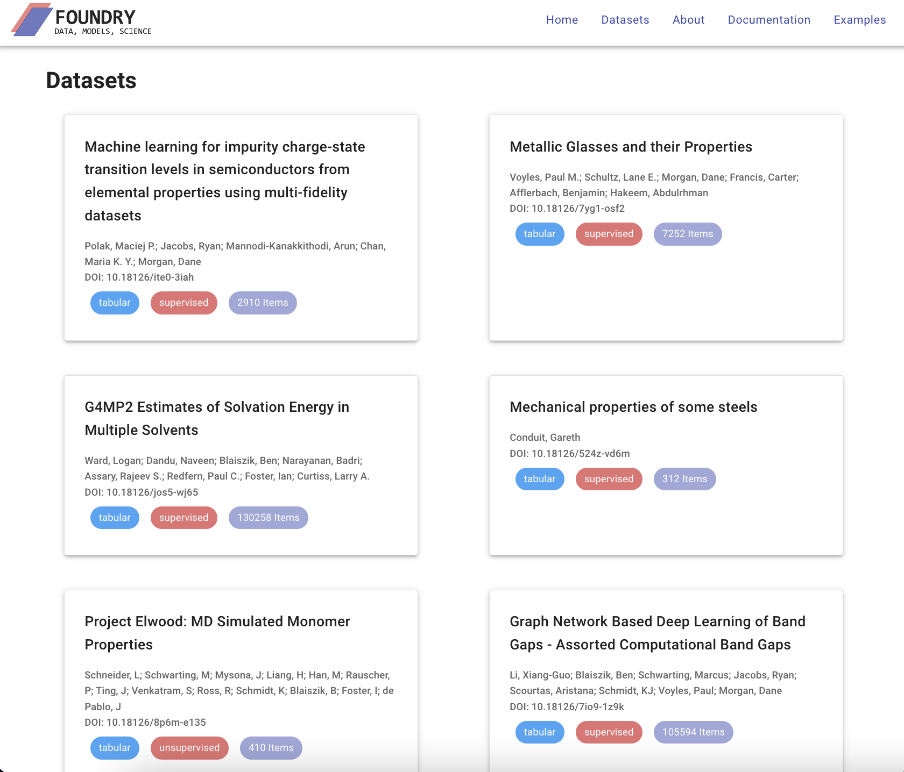

# Foundry

---
title: 'Foundry-ML - Software and Services to Simplify Access to Machine
Learning Datasets and Models in Materials Science'

tags:
  - Python
  - Machine Learning
  - Artificial Intelligence
  - Materials Science
  - Data

<!-- to do: 
Update authors with ORCID ID's
fill out the equal-contrib part. There are other selections to choose from
-->

authors:
   - name: KJ Schmidt
    orcid: 0000-0000-0000-0000
    equal-contrib: true 
    affiliation: "1, 2"
  - name: Aristana Scourtas
    orcid: 0000-0000-0000-0000
    equal-contrib: true
    affiliation: "1, 2"
  - name: Marcus Schwarting
    orcid: 0000-0000-0000-0000
    equal-contrib: true
    affiliation: 3
  - name: Isaac Darling
    orcid: 0000-0000-0000-0000
    equal-contrib: true
    affiliation: 3
  - name: Ethan Truelove
    orcid: 0000-0000-0000-0000
    equal-contrib: true
    affiliation: 3
  - name: Aadit Ambadkar
    orcid: 0000-0000-0000-0000
    equal-contrib: true
    affiliation: 1
  - name: Ribhav Bose
    orcid: 0000-0000-0000-0000
    equal-contrib: true
    affiliation: 1
  - name: Zoa Katok
    orcid: 0000-0000-0000-0000
    equal-contrib: true
    affiliation: 1
  - name: Jingrui Wei
    orcid: 0000-0000-0000-0000
    equal-contrib: true
    affiliation: 4  
  - name: Xiangguo Li
    orcid: 0000-0-0000-0000
    equal-contrib: true
    affiliation: 4  
  - name: Ryan Jacobs
    orcid: 0000-0000-0000-0000
    equal-contrib: true
    affiliation: 4 
  - name: Michael Ferris
    orcid: 0000-0000-0000-0000
    equal-contrib: true
    affiliation: 5  
  - name: Paul Voyles
    orcid: 0000-0000-0000-0000
    equal-contrib: true
    affiliation: 4
  - name: Dane Morgan
    orcid: 0000-0000-0000-0000
    equal-contrib: true
    affiliation: 4
  - name: Ian Foster
    orcid: 0000-0000-0000-0000
    equal-contrib: true
    affiliation: "1, 2, 3"
  - name: Ben Blaiszik
    orcid: 0000-0000-0000-0000
    equal-contrib: true
    affiliation: "1, 2"

affiliations:
 - name: Globus, University of Chicago
   
   index: 1

 - name: Data Science and Learning Division, Argonne National Laboratory
   
   index: 2

 - name: Department of Computer Science, University of Chicago
   
   index: 3

 - name: Department of Materials Science and Engineering, University of Wisconsin-Madison
   
   index: 4

 - name: Department of Computer Science, University of Wisconsin-Madison
   
   index: 5

date: January 2023

bibliography: paper.bib

---

# Summary

Machine learning and data science approaches are becoming critical to scientific and technological
advancement, with thousands of new scientific publications yearly[?] and countless private companies relying on ML as critical aspects of their business models[?]. For this growth to translate into applications
and scientific impact, datasets need to be easily accessible for training, retraining, reproducing, and verifying usefulness on chosen tasks. Unfortunately, the discovery of datasets, models, and the underlying code is a challenge and often impossible task if they are not published openly[1].
<!-- Add references to -->

To overcome this challenge, we introduce Foundry-ML, a service to enable researchers a simple path to publish
and discover datasets for machine learning in science. Foundry-ML is a synthesis of service capabilities from 
the Materials Data Facility[2] and DLHub[3], layered with Python software tooling, standardized metadata, and 
a file structure specification to meet the needs of the machine learning community.

# Statement of need

The application of open science and machine learning to science, engineering, and industry-relevant problems is a critical, well-recognized component of cross-department U.S. AI strategy. In particular, these are proposed as a new engine to drive new technological innovation and economic prosperity across diverse sectors. Yet, the processes by which high-quality datasets remains decentralized, without standards, and scattered with a few notable
exceptions. With Foundry-ML, we provide 1) a simple Python interface that allows users to access structured ML-ready materials science 
and chemistry datasets with just a few lines of code and 2) a place where users can publish their own ML-ready datasets in a self-service manner.

<!-- Add screenshot of web user interface -->

* Foundry-ML focuses on accessibility, reproducibility, and collaboration within research. Users can upload large datasets and models to Foundry, making them easy to share, use, and discover by the rest of the scientific community \autoref{Figure 1}.

* Foundry-ML provides a curated collection of machine learning ready datasets. Users can access any Foundry dataset without barriers. All datasets are listed on the website with full instructions on how to use them. We believe in access to high quality data, so all of the datasets go through a curation process where an actual person assesses the data.

* With interpretability in mind, we created required metadata that is completed by the authors of each dataset. All metadata is formatted the same way, so it's easy to understand across all of our content. Reproducibility efforts on the data side become almost trivial.

Foundry-ML's infrastructure built with MDF and Globus is designed for sharing large files, making collaboration easy.

While the example presented here come from the domains of materials science and chemistry, Foundry-ML is designed to be domain agnostic. This
will allow the same software to be a part of solving similar problems across scientific domains.

As of Q1 2023, we have collected and made available 30 datasets in the Foundry format with examples ranging from tabular data 
<!-- Fix these refs (e.g., Zeolite, Logan's work...)  -->
to image sets 
<!-- Fix these refs (Northwestern, Wisconsin, ARPA-E.. ) -->

It has been successfully used in educational curricula
<!-- Cite Northwestern NanoHub -->
<!-- @misc { 35361,
	title = {Machine Learning in Materials Science: Image Analysis Using Convolutional Neural Networks in MatCNN},
	month = {Nov},
	url = {https://nanohub.org/resources/35361},
	year = {2021},
	author = {Stan , Tiberiu and James , Jim and Pruyne , Nathan and Schwarting , Marcus and Yeom , Jiwon and Voorhees , Peter and Blaiszik , Ben J and Foster , Ian and Emery , Jonathan D}
} -->
and by research teams at the University of Chicago, Argonne National Lab, the University of Wisconsin, MIT \autoref{fig 2}, and more. In \autoref{Figure 2}, we highlight a use case for the ML-guided design of organic structure–directing agents (OSDAs) to promote zeolite formation. With just a few lines of code and the dataset DOI \autoref{fig 2}a, a researcher can load descriptive metadata \autoref{fig 2}b to understand the dataset contents, and load the data \autoref{fig 2}c for analysis and exploration.     
<!-- cite{DOI: 10.1126/science.abh3350} -->

<!-- Screenshot showing one use case -->
![A Foundry-ML use case for zeolite design. (a) A user instantiates the Python client and loads the descriptive metadata using the DOI. (b) Descriptive metadata includes information about the keys included in the datasets, associated units, and a short description. The metadata also include information about the dataset including the associated splits (e.g., train, test, validate), and the amount of data included. (c) A user can then load the data using the `load_data` function. This function returns a Pandas or Dask dataframe for tabular data.  The zeolite dataset show here, its metadata, and the data itself from researchers Daniel Schwalba-Koda and Rafael Gomez-Bombarelli.\label{fig 2}](JOSS-zeolite.png)

# Future Directions
 <!-- Mention models and Garden connections -->
 In future work, we intend to add capabilities to Foundry-ML that enable publication and connection with machine learning models creating a combined ecosystem of datasets and models. This work will be completed in collaboration with the new NSF project (#2209892) Garden: A FAIR Framework for Publishing and Applying AI Models for Translational Research in Science, Engineering, Education, and Industry.

# Documentation
<!-- Link notebooks and docs -->
To learn more, please read our [documentation](https://ai-materials-and-chemistry.gitbook.io/foundry/v/docs/) and look through our [example notebooks](https://github.com/MLMI2-CSSI/foundry/tree/main/examples). 

# Citations

<!-- Notes to be organized before putting it all in the bib:

1. Reproducibility standards for machine learning in the life sciences

  Maybe also: 
  D. Morgan and R. Jacobs, “Opportunities and challenges for machine learning in materials science,”
  Annual Review of Materials Research, vol. 50, pp. 71–103, 2020

2. MDF paper(s) - 
  B. Blaiszik, L. Ward, M. Schwarting, J. Gaff, R. Chard, D. Pike, K. Chard, and I. Foster, “A data ecosys-
  tem to support machine learning in materials science,” MRS Communications, vol. 9, no. 4, pp. 1125–
  1133, 2019

  B. Blaiszik, K. Chard, J. Pruyne, R. Ananthakrishnan, S. Tuecke, and I. Foster, “The Materials Data
  Facility: Data services to advance materials science research,” Journal of Materials, 2016.

3. DLHub paper - 
  Z. Li, R. Chard, L. Ward, K. Chard, T. J. Skluzacek, Y. Babuji, A. Woodard, S. Tuecke, B. Blaiszik,
  and M. J. Franklin, “DLHub: Simplifying publication, discovery, and use of machine learning models in
  science,” Journal of Parallel and Distributed Computing, vol. 147, pp. 64–76, 2021.

4. UW paper (bandgaps or atom position finding) - 
  J. Wei, B. Blaiszik, D. Morgan, and P. Voyles, “Benchmark tests of atom-locating CNN models with a
  consistent dataset,” Microscopy and Microanalysis, vol. 27, no. S1, pp. 2518–2520, 2021.

  X.-G. Li, B. Blaiszik, M. E. Schwarting, R. Jacobs, A. Scourtas, K. Schmidt, P. M. Voyles, and D. Mor-
  gan, “Graph network based deep learning of bandgaps,” The Journal of Chemical Physics, vol. 155,
  no. 15, p. 154702, 2021

5. Zeolite paper

6. ?  

-->

Citations to entries in paper.bib should be in
[rMarkdown](http://rmarkdown.rstudio.com/authoring_bibliographies_and_citations.html)
format.

If you want to cite a software repository URL (e.g. something on GitHub without a preferred
citation) then you can do it with the example BibTeX entry below for @fidgit.

For a quick reference, the following citation commands can be used:
- `@author:2001`  ->  "Author et al. (2001)"
- `[@author:2001]` -> "(Author et al., 2001)"
- `[@author1:2001; @author2:2001]` -> "(Author1 et al., 2001; Author2 et al., 2002)"

# Figures

Figures can be included like this:

and referenced from text using \autoref{fig:example}.

Figure sizes can be customized by adding an optional second parameter:
{ width=20% }

# Acknowledgements

This work was supported by the National Science Foundation under NSF Award Number: 1931306 "Collaborative Research: Framework: Machine Learning Materials Innovation Infrastructure". **MDF** This work was performed under the following financial assistance award 70NANB19H005 from U.S. Department of Commerce, National Institute of Standards and Technology as part of the Center for Hierarchical Materials Design (CHiMaD).

# References
