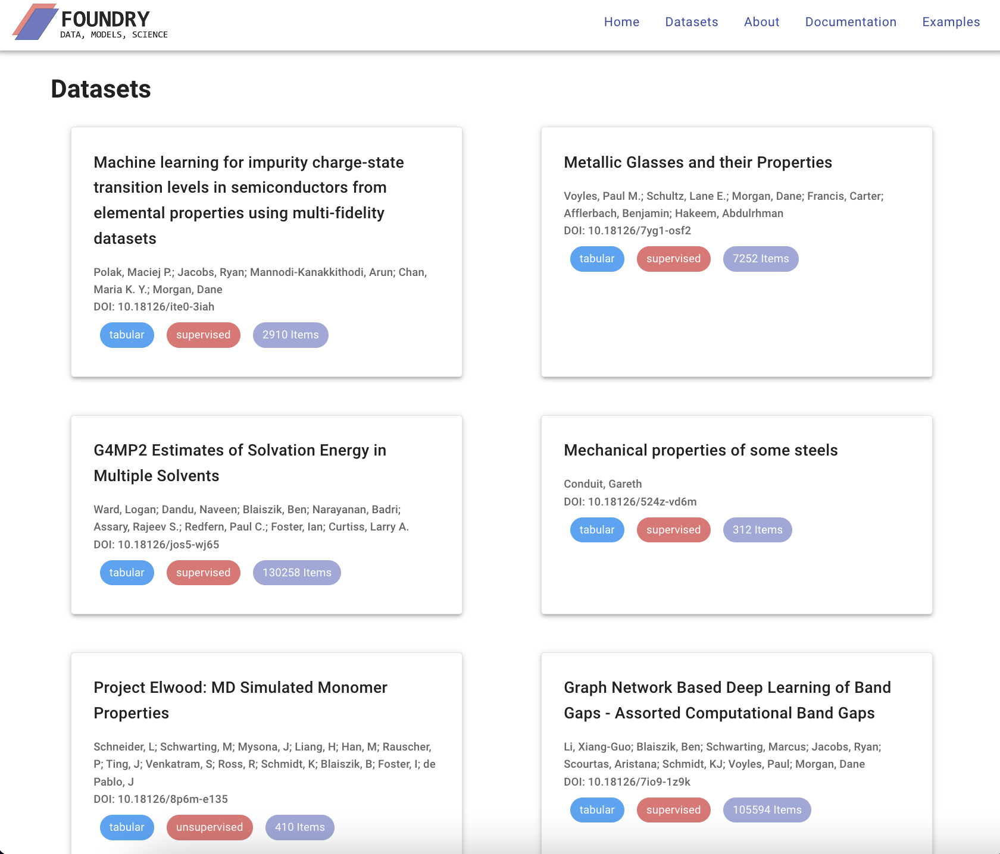

# Summary

The application of open science and machine learning to scientific, engineering, and industry-relevant problems is a critical component of the cross-department U.S. Artificial Intelligence (AI) strategy highlighted e.g., by the AI Initiative, the recent National AI Strategy report [@nairr], the Year of Open Data [@yearofopendata], Materials Genome Initiative [@mgidepablo;@ward2015materials], and more. A key aspect of these strategies is to ensure that infrastructure exists to make datasets easily accessible for training, retraining, reproducing, and verifying model performance on chosen tasks. However, the discovery of high-quality, curated datasets adhering to the FAIR principles (findable, accessible, interoperable and reusable) remains a challenge.

To overcome these dataset access challenges, we introduce Foundry-ML, software that combines several services to provide researchers capabilities to publish and discover structured datasets for ML in science, specifically in materials science and chemistry. Foundry-ML consists of a Python client, a web app, and standardized metadata and file structures built using services including the Materials Data Facility[@mdf-2019; @mdf-2016] and Globus [@ananthakrishnan2018globus; @chard2015globus]. Together, these services work in conjunction with Python software tooling to dramatically simplify data access patterns, as we show below.

# Statement of need

The processes by which high-quality structured science datasets are published and accessed remains decentralized, without shared standards, and scattered with some exceptions (e.g., [@matbench, @moses, @moleculenet; @wei2021benchmark]). With Foundry-ML, we provide 1) a simple Python interface that allows users to access structured ML-ready materials science and chemistry datasets with just a few lines of code, 2) a prototype web-based interface for dataset search and discovery, and 3) software that enables users to publish their own ML-ready datasets in a self-service manner.

Foundry-ML focuses foremost on accessibility and reproducibility. \autoref{fig1} shows an example of how, with just a few lines of code, researchers can access a curated collection of ML-ready datasets, the associated metadata describing the dataset contents, split details (e.g., train, test, validate), and other information (e.g., number of entries). As of Q1 2023, we have collected and made available 30 datasets in Foundry with data representations including tabular data (e.g., csv, Excel), key-value data (e.g, JSON), image sets, and hierarchical data (e.g., HDF5). 

![A Foundry-ML use case for zeolite design. (a) A user instantiates the Foundry-ML Python client and loads the descriptive metadata using the DOI. (b) Descriptive metadata includes information about the keys included in the datasets, associated units, and a short description. The metadata also include information about the dataset including the associated splits (e.g., train, test, validate), and the amount of data included. (c) A user can then load the data using the `load_data` function. This function returns a Pandas or Dask dataframe for tabular data.  The zeolite dataset shown here, its metadata, and the data itself from researchers Daniel Schwalba-Koda and Rafael Gomez-Bombarelli.\label{fig1}](JOSS-zeolite.png)

Foundry-ML is built upon a solid base.
We have developed Foundry-ML using the Materials Data Facility (MDF) [@mdf-2019; @mdf-2016] and Globus services like Auth, Transfer, and Search. Foundry-ML users can upload large datasets (MDF supports multi-TB databases, with potentially millions of files), making them easy to share, use, and discover by the rest of the scientific community.  All datasets are made available through the Foundry-ML software, the Foundry-ML webapp and also via Globus endpoints that support both Globus and HTTPS access.

Beyond just simplified data access, enhanced interpretability is a key feature of Foundry-ML. Foundry-ML datasets have required metadata (see \autoref{fig1}b) that are provided by the authors of each dataset. All metadata are stored in Globus Search [@globuspublish] to facilitate queries. To make these metadata easily usable by Foundry-ML users, query helpers are provided via the Foundry-ML Python client to perform common actions e.g., listing all datasets, selecting datasets by DOI, and more.

In addition to the Python software interface to each dataset, we have developed a prototype web interface (\autoref{fig2}) that lists all datasets with instructions on how to access them and key features of each dataset (e.g., number of entries, inputs, targets, type of data, tags, free text description). While the examples presented here come from the domains of materials science and chemistry, Foundry-ML is designed to be domain agnostic, and since similar problems exist in other domains, we expect these approaches to generalize. Generalizing to other domains will allow the same software and services to help solve similar problems across scientific domains.

# Usage
Foundry has been successfully used in educational curricula [@foundrynanohub]
and to publish datasets by research teams at the University of Chicago, Argonne National Lab, the University of Toronto [@dmc], 3M [@mmm], the University of Wisconsin [@wei2021benchmark; @li2021graph], MIT [@schwalbe2021priori] \autoref{fig 2}, and many more. In \autoref{fig 2}, we highlight a use case for the ML-guided design of organic structure–directing agents (OSDAs) to promote zeolite formation from the team of Gomez-Bombarelli at MIT. By using only the Foundry-ML software and the dataset DOI \autoref{fig1}a, which could be cited in a paper or retrieved from the Foundry-ML web app or software, a researcher can load descriptive metadata \autoref{fig1}b to understand the dataset contents, and load the data \autoref{fig1}c for analysis, exploration, and replication. A notebook showcasing this use case is available at in the GitHub examples linked in the Documentation section below.     

# Future Directions
In future work, we intend to add capabilities to Foundry-ML that enable publication and connection of datasets with ML models creating a combined ecosystem of datasets and models. This work will be completed in collaboration between two National Science Foundation (NSF) projects, (#1931306) “Collaborative Research: Framework: Machine Learning Materials Innovation Infrastructure” and (#2209892) "Garden: A FAIR Framework for Publishing and Applying AI Models for Translational Research in Science, Engineering, Education, and Industry". We also plan to generalize the metadata and extend these capabilities to scientific datasets in domains beyond materials and chemistry.

# Documentation
Detailed Foundry-ML documentation is available via GitBook at the following location [GitBook documentation](https://ai-materials-and-chemistry.gitbook.io/foundry/v/docs/). We have also have compiled [example notebooks](https://github.com/MLMI2-CSSI/foundry/tree/main/examples) that show how to publish, retrieve, and use select Foundry-ML datasets. 

# Acknowledgements
This work was supported by the National Science Foundation under NSF Award Number: 1931306 "Collaborative Research: Framework: Machine Learning Materials Innovation Infrastructure". **MDF** This work was performed under the following financial assistance award 70NANB19H005 from U.S. Department of Commerce, National Institute of Standards and Technology as part of the Center for Hierarchical Materials Design (CHiMaD).

# References
