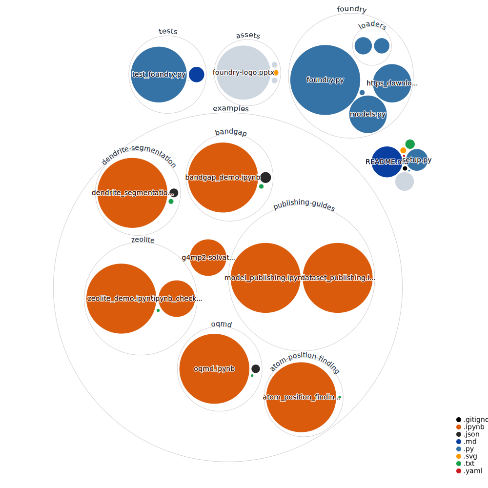

Foundry is a Python package that simplifies the discovery and usage of machine-learning ready datasets in materials science and chemistry. Foundry provides software tools that make it easy to load these datasets and work with them in local or cloud environments. Further, Foundry provides a dataset specification, and defined curation flows, that allow users to create new datasets for the community to use through this same interface.

# Documentation
Information on how to install and use foundry can be found in our documentation [here](https://ai-materials-and-chemistry.gitbook.io/foundry/v/docs/).

DLHub documentation for model publication and running information can be found [here](https://dlhub-sdk.readthedocs.io/en/latest/servable-publication.html).

# Primary Support
This work was supported by the National Science Foundation under NSF Award Number: 1931306 "Collaborative Research: Framework: Machine Learning Materials Innovation Infrastructure".

# Other Support
Foundry brings together many components in the materials data ecosystem. Including [MAST-ML](https://mastmldocs.readthedocs.io/en/latest/), the [Data and Learning Hub for Science](https://www.dlhub.org) (DLHub), and the [Materials Data Facility](https://materialsdatafacility.org) (MDF).

## MAST-ML
This work was supported by the National Science Foundation (NSF) SI2 award No. 1148011 and DMREF award number DMR-1332851

## The Data and Learning Hub for Science (DLHub)
This material is based upon work supported by Laboratory Directed Research and Development (LDRD) funding from Argonne National Laboratory, provided by the Director, Office of Science, of the U.S. Department of Energy under Contract No. DE-AC02-06CH11357.
https://www.dlhub.org

## The Materials Data Facility
This work was performed under financial assistance award 70NANB14H012 from U.S. Department of Commerce, National Institute of Standards and Technology as part of the [Center for Hierarchical Material Design (CHiMaD)](http://chimad.northwestern.edu). This work was performed under the following financial assistance award 70NANB19H005 from U.S. Department of Commerce, National Institute of Standards and Technology as part of the Center for Hierarchical Materials Design (CHiMaD). This work was also supported by the National Science Foundation as part of the [Midwest Big Data Hub](http://midwestbigdatahub.org) under NSF Award Number: 1636950 "BD Spokes: SPOKE: MIDWEST: Collaborative: Integrative Materials Design (IMaD): Leverage, Innovate, and Disseminate".
https://www.materialsdatafacility.org

## Visualization of Our Code

Using [githubocto/repo-visualizer](https://github.com/githubocto/repo-visualizer)

## Screenshots
<h3 align=center>Atom Position Finding</h3>

<h3 align = center>Band gap</h3>

<h3 align = center>Dendrite Segmentation</h3>

<h3 align = center>Solvation</h3>

