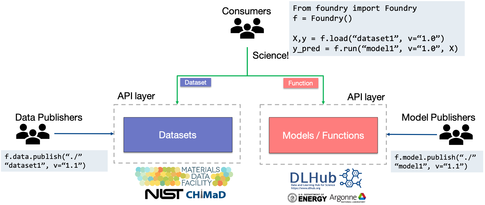

# Overview

TODO:

* Change the code snippet in the image
* Write the text :\)


**Note:** The code snippet in the image above uses a simplified, older version of the API. For current usage, please refer to the examples in our Quickstart guide in the main [Foundry documentation](https://ai-materials-and-chemistry.gitbook.io/foundry/getting-started-1/examples). Key differences include using `f.search()` to find datasets and `dataset_object.get_as_dict()` (or its alias `dataset_object.load()`) to load data.


