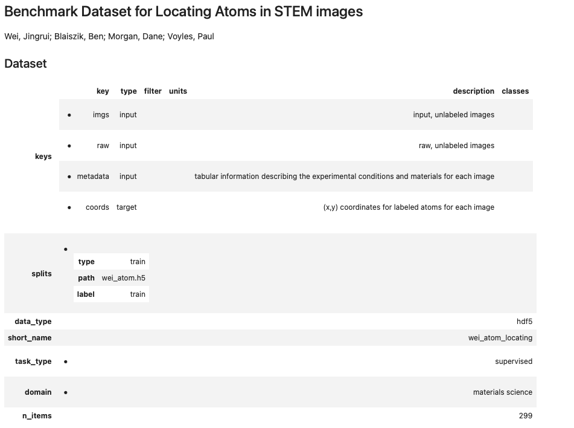

# Getting Started with Python

## Scientific Examples

[Checkout our example notebooks ](https://github.com/MLMI2-CSSI/foundry/tree/master/examples)for how to load or publish datasets using Foundry.

## Quickstart

### Creating a Foundry Client

The Foundry client provides access to all of the methods described here for listing, loading, and publishing datasets and models. The code below will create a Foundry client 

```python
from foundry import Foundry
f = Foundry()
```


If you are running your script on cloud resources \(e.g. Google Colab, Binder\), see [Using Foundry on Cloud Computing Resources](examples.md#using-foundry-on-cloud-computing-resources)


### Listing Datasets

To show all available Foundry datasets, you can use the Foundry `list()` method as follows. The method returns a pandas DataFrame with details on the available datasets.

```python
f.list()
```

### Loading Datasets

The Foundry client can be used to access datasets using a `source_id` or a digital object identifier \(DOI\) e.g. here `"foundry_wei_atom_locating_benchmark"` or `"10.18126/e73h-3w6n"`_._ You can retrieve the `source_id` or the DOI from the [`list()` method](examples.md#listing-datasets).

```python
from foundry import Foundry

f = Foundry(index="mdf")
f = f.load("10.18126/e73h-3w6n") # Here we are now downloading and caching the data
```

This will remotely load the metadata \(e.g., data location, data keys, etc.\) and download the data to local storage if it is not already cached. Data can be downloaded via HTTPS without additional setup or more optimally with a Globus endpoint [set up](https://www.globus.org/globus-connect-personal) on your machine.



Once the data are accessible locally, access the data with the `load_data()` method. Load data allows you to load data from a specific split that is defined for the dataset, here we use `train`.

```python
res = f.load_data()
imgs = res['train']['input']['imgs']
coords = res['train']['input']['coords']


# Show some images with coordinate overlays
import matplotlib.pyplot as plt

n_images = 3
offset = 150
key_list = list(res['train']['input']['imgs'].keys())[0+offset:n_images+offset]

fig, axs = plt.subplots(1, n_images, figsize=(20,20))
for i in range(n_images):
    axs[i].imshow(imgs[key_list[i]])
    axs[i].scatter(coords[key_list[i]][:,0], 
                   coords[key_list[i]][:,1], s = 20, c = 'r', alpha=0.5)
```


## Using Foundry on Cloud Computing Resources

Foundry works with common cloud computing providers \(e.g., the NSF sponsored Jetstream and Google Colab\). On these resources, simply add the following arguments to use a cloud-compatible authentication flow.

```python
f = Foundry(no_browser=True, no_local_server=True)
```

When downloading data, add the following argument to download via HTTPS.


This method may be slow for large datasets and datasets with many files


```python
f.load(globus=False)
X, y = f.load_data()
```

