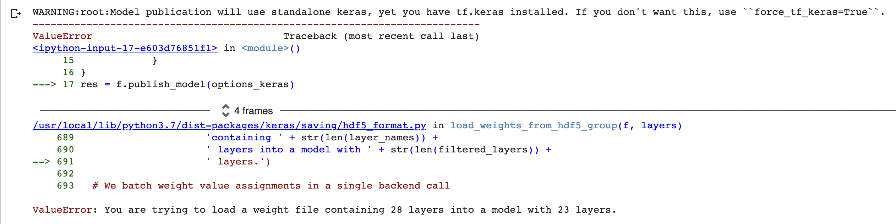

# Troubleshooting

### Issues with loading or publishing Keras or Tensorflow models



There is a difference between the older, plain Keras package installed via `import keras`, and the currently maintained and up-to-date Keras package installed via `from tensorflow import keras`. Currently, the DLHub SDK \(which Foundry uses under-the-hood to publish, pull, and run models and functions\) uses whichever version of Keras you have installed. 

Errors can arise when `tf.keras` is used in one part of the model pipeline, but plain `keras` is used in another.

If you have both versions of Keras installed \(which can be the case in common container environments, such as Google Colab\), DLHub will default to the plain Keras version, in case the user wants to use that with the newest version of Tensorflow. To override this functionality and use the Tensorflow Keras instead when publishing your model, pass the `force_tf_keras = True`option to `publish_model()`. 

```python
# Assume our fitted model is '7-fi-1.hdf5'.
# Create the metadata for the model
import os

options_keras = {
            "title": "Bandgap-7-fidelity-MP-JARVIS-1",
            "short_name": "7-fi-1",
            "authors": ["Scientist, Awesome"],
            "servable": {
                "type": "keras",
                "model_path": "7-fi-1.hdf5",
                "custom_objects": {"softplus2": softplus2, 
                                   "MEGNetLayer": MEGNetLayer,
                                   "Set2Set": Set2Set},
                "force_tf_keras": True
            }
}
res = f.publish_model(options_keras)
```

